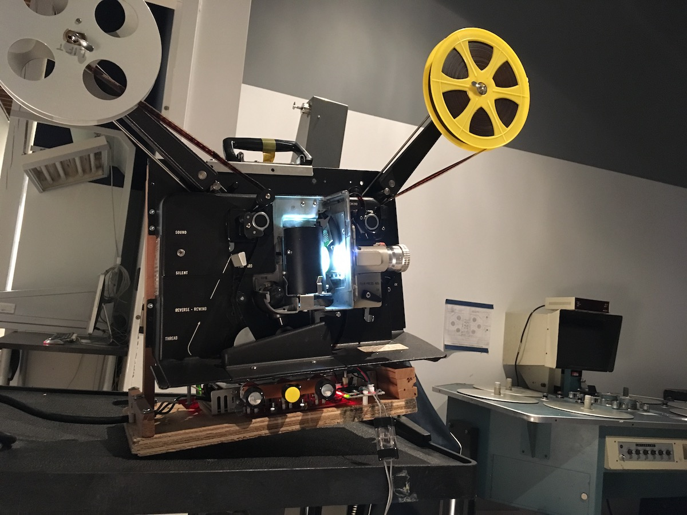
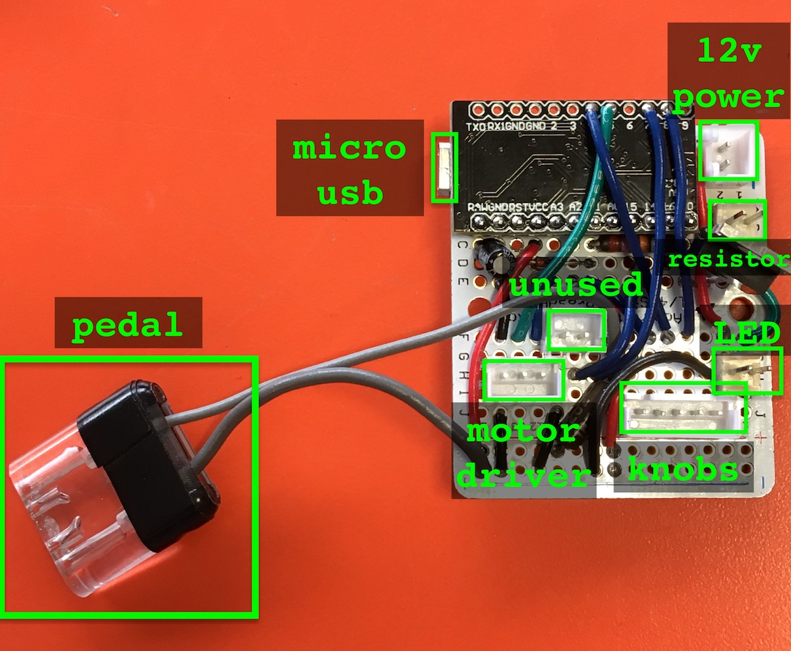

# Principle of the Sewing Machine

## Project overview

> The photographic apparatus invented at almost the same time by the Lumière brothers in Europe and the entrepreneur Edison in the USA was both a camera and a projector. The device combined the “principle of the sewing machine” (a light-sensitive strip perforated evenly along both sides can be moved forward by pilot pins engaging these perforation holes) with the “principle of the bicycle” (a crank is responsible for forward movement). All the rest is the technology of photography: lens systems, apertures, negatives, positives.
>
> –Alexander Kluge: “Three machines that make up cinema”, Cinema Stories. 2007.

**What would’ve happened if that new machine wouldn’t have excluded the use of sewing?**

To counter the stereotype imposed by the hegemonic narrative of history on the female as technophobic, we [ aitziber olaskoaga and pilar monsell ] ally with old and new machines with the desire of reinventing the PRINCIPLE OF THE SEWING MACHINE. We want to explore the best way of sharing our artistic and technical skills, the potentiality of the collective and open source processes, while weaving encounters among working women from different industries, especially the audiovisual and textile.

## This repository

This git repository contains the code and documentation for the machine created in collaboration with Aitzi for this project during her residency at LIFT in Toronto.

## Live LED diagnostics

Our timeline was too short to source a constant-current drive for the LED, so instead we measured the forward voltage of the LED, and used a power resistor to limit current. The headroom is small (~2V out of 12), so it's a good idea to always make sure the fan is working, and often check the built-in diagnostics:

1. Connect a computer to the Arduino using a micro-usb (ie., android charger) cable.
2. Open Arduino and launch the Serial Monitor (top-right button like a magnifying glass)
3. It should show lots of "nominal" readings. Sometimes it measures at a bad moment and says WARNING when all the other readings are ok. This is fine.
4. If the readings are much above nominal, and especially if WARNING message come more often, something might be wrong. Turn the lamp down (or off), check the fan, etc.

If the Serial Monitor is not working, or producing garbage output, ensure that the baudrate of the serial monitor is set to 9600.

> Note: the LED's power resistor connects to ground, and we measure voltage off the other side of it with an analog input. With this, we can measure the current. LEDs operate with lower resistance as they get hotter, consuming more current. If they get too hot, this can lead to "thermal runaway" and destroy the LED. Our power resistor is small, but helps give some protection from this. Our cooling system is good, and gives more protection. It's important that cooling is always working well!

## Motor health

The motor should not get too hot to touch. It seemed alright, but maybe a liiiiiitle hot in our longer-running tests at the end. It would be a great idea to add another 12V fan in the system to help keep it cool so it lasts a longer life.

## Control board

Everything connected to the control board is removable via connectors. Most of the connectors were chosen to be different types, so that they can't be plugged in wrong. Here's a visual guide for which parts should attach via which connector:

Most connections are polarized (can't be connected backward), but, notably, the power resistor plug can go in either way (and this is safe).

The power resistor and LED connectors are almost the same – really best not to mix them up. Mixing them probably won't cause harm, but the LED diagnostics will be wrong, and it might stress some of the parts more than we'd like.

## Code

There are a lot of comments in the [source code](principle-sewing-machine/principle-sewing-machine.ino) for the controller. Particularly, there are some behaviour constants at the top of the file that will change the "feel" of certain aspects of the machine, which might be worth playing with.
